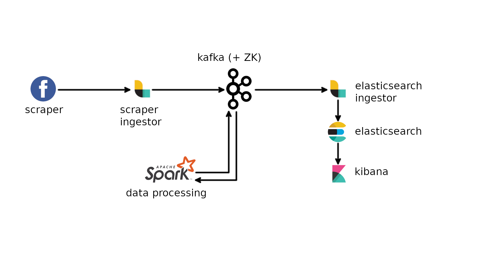

# Untitled Princess Carolyn Project


microservices application for Facebook posts analysis

## Introduction
Developed as final project for the 'Technlogies for Advanced Programming' course at DMI UniCT,
it's a microservice application based on Docker that offers the following services:
- **scraping** of one or more target Facebook posts
- **sentiment analysis** on the scraped data (posts and top level comments)
- **visualization** of the processed data on a interactive dashboard

## Quickstart
- search for the 'scraper' service in the 'compose.yaml' file
- set the 'TARGETS' environment variable with a comma separated list of post IDs:
```
TARGETS=post_ID
```
- login to Facebook and extract the cookies (es. using EditThisCookie on Chrome)
- save your cookies in PROJECT_ROOT_DIRECTORY/scraper/cookies.json
- launch the application from its root directory:
```
docker-compose up
```
- open a browser and go to *localhost:5601* to open the Kibana web interface (**NOTE:** could take a while before the service is ready)
- click on the menu button, then on 'Dashboard' and finally select the 'post dashboard'
- use the control on the top right of the page to select an appropriate time range (es. the target post was published today, select a range that includes today)
- in the 'Post selector' control, enter the ID of the post of interest to update the dashboard with your post data

## Architecture



